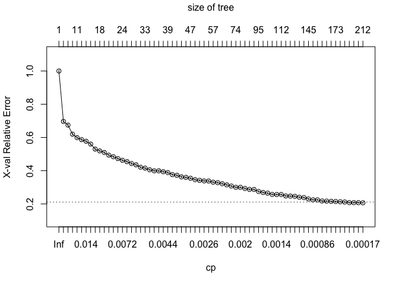

# Coursera Course Project Machine Learning
Jikke Romijn  
13 juli 2016  

This document contains my work for the Coursera Machine Learning course project. The purpose of this project is to pick and tune a machine learning algorithm for predicting the manner in which subjects have performed an exercise, from physical data that have been collected by sensors on the belt, forearm, arm, and dumbbell of 6 participants. The goal is to be able to predict from these data how well the exercise was executed.

***Executive Summary***

I have tried various different algorithms that are specifically useful for classification predictions. I have used internal cross-validation in caret's train-function to get an estimate of out of sample accuracy of each algorithm. These analyses showed that the Random Forest algorithm is very accurate, with 98.4% accuracy and 1.41% out of sample error (see Figure 4).

***Data preparation and exploration***

First, I opened the available training and testing data and prepared it for the analysis:


```r
###Loading necessary libraries
library(caret);library(dplyr);library(class); library(rpart)
```

```
## Loading required package: lattice
## Loading required package: ggplot2
## 
## Attaching package: 'dplyr'
## 
## The following objects are masked from 'package:stats':
## 
##     filter, lag
## 
## The following objects are masked from 'package:base':
## 
##     intersect, setdiff, setequal, union
```

```r
###Reading the downloaded files
training <- read.csv("./pml-training.csv", header=TRUE, na.strings=c("NA",""))
testing <- read.csv("./pml-testing.csv", header=TRUE, na.strings=c("NA",""))

###Preprocessing the data
###Many variables contain (almost) only NA's. I remove these from both datasets
training <- training[, (colSums(is.na(training))==0)]
testing <- testing[, (colSums(is.na(testing))==0)]

###Some variables contain information about the measurements, but aren't potential predictors. I remove these from both datasets
backgrvars <- grepl("X|user_name|timestamp|window", colnames(training))
training <- training[, !backgrvars]
backgrvars <- grepl("X|user_name|timestamp|window", colnames(testing))
testing <- testing[, !backgrvars]
```

Next, I split the training set into a training and a validation set for cross validation purposes.


```r
###Creating a subset from training set for cross validation
set.seed(123)
inTrain <- createDataPartition(y=training$classe,
                               p=0.60, list=FALSE)
training <- training[inTrain,]
validation <- training[-inTrain,]
```

***Feature Selection***

The data have 52 variables that are potential predictors of the quality of the exercise (the 'classe' variable). Many variables are likely to be highly correlated as they are just different parameters coming from the same sensor. To prevent overfitting and also to reduce computing time as my computer tends to have trouble with some algorithms, I used a correlation matrix to drop some highly correlated variables from the training data set. This reduced the number of potential predictors from 52 to 30.


```r
###Perform analysis to find the important features to include in the models and save them in a reduced training data set.
correlationMatrix <- cor(training[,1:52])
highlyCorrelated <- findCorrelation(correlationMatrix, cutoff=0.70)
highlyCorrelated <- sort(highlyCorrelated)
training_reduced <- training[, -c(highlyCorrelated)]
dim(training)
```

```
## [1] 11776    53
```

```r
dim(training_reduced)
```

```
## [1] 11776    30
```

***1st model: Decision Tree using rpart package***

The most simple solution for dealing with classification problems is to use a decision tree. The tuning parameter of the rpart algorithm is the complexity parameter (cp). It is used to control the size of the decision tree and to select the optimal tree size. If the cost of adding another variable to the decision tree from the current node is above the value of cp, then tree building does not continue. I have pruned the decision tree based on the cp associated with the lowest relative error (see Figure 1).

The in-sample accuracy of the decision tree is 90.9%. In order to estimate the out of sample accuracy I predicted the "classe" variable in the validation data set. In the validation data set the predictions are also 90.9% accurate. 


```r
###Grow a tree using the Rpart package
set.seed(123)
ModTree <- rpart(classe ~ ., data=training_reduced, control=rpart.control(minsplit=30, cp = 0.0001))

###Create a variable called bestcp (for Best Complexity Parameter) to use for pruning based on lowest cross-validated error
bestcp <- ModTree$cptable[which.min(ModTree$cptable[,"xerror"]),"CP"]

###Prune the tree based on the lowest cross-validated error
ModTreepruned <- prune(ModTree, cp = bestcp)
printcp(ModTreepruned)
```

```
## 
## Classification tree:
## rpart(formula = classe ~ ., data = training_reduced, control = rpart.control(minsplit = 30, 
##     cp = 1e-04))
## 
## Variables actually used in tree construction:
##  [1] accel_forearm_x      accel_forearm_z      gyros_arm_y         
##  [4] gyros_arm_z          gyros_belt_x         gyros_belt_y        
##  [7] gyros_belt_z         gyros_forearm_x      gyros_forearm_z     
## [10] magnet_arm_x         magnet_arm_z         magnet_belt_x       
## [13] magnet_belt_y        magnet_dumbbell_z    magnet_forearm_x    
## [16] magnet_forearm_y     magnet_forearm_z     pitch_arm           
## [19] pitch_dumbbell       pitch_forearm        roll_arm            
## [22] roll_dumbbell        roll_forearm         total_accel_arm     
## [25] total_accel_dumbbell total_accel_forearm  yaw_arm             
## [28] yaw_dumbbell         yaw_forearm         
## 
## Root node error: 8428/11776 = 0.71569
## 
## n= 11776 
## 
##            CP nsplit rel error  xerror      xstd
## 1  0.04241813      0   1.00000 1.00000 0.0058081
## 2  0.02218794      5   0.69471 0.69637 0.0064379
## 3  0.01999288      6   0.67252 0.67442 0.0064340
## 4  0.01625534      9   0.61082 0.61972 0.0063967
## 5  0.01506882     10   0.59457 0.59919 0.0063724
## 6  0.01400095     11   0.57950 0.58685 0.0063550
## 7  0.01322971     12   0.56550 0.57712 0.0063398
## 8  0.01275510     14   0.53904 0.56028 0.0063104
## 9  0.01115330     16   0.51353 0.53014 0.0062479
## 10 0.01091599     17   0.50237 0.51898 0.0062214
## 11 0.00996678     18   0.49146 0.50949 0.0061975
## 12 0.00913621     19   0.48149 0.49347 0.0061541
## 13 0.00854295     20   0.47235 0.48398 0.0061265
## 14 0.00723778     21   0.46381 0.47307 0.0060931
## 15 0.00711913     23   0.44934 0.46251 0.0060591
## 16 0.00676317     24   0.44222 0.45456 0.0060323
## 17 0.00640721     27   0.42193 0.44317 0.0059921
## 18 0.00628856     29   0.40911 0.43533 0.0059632
## 19 0.00545800     30   0.40282 0.42086 0.0059072
## 20 0.00510204     32   0.39191 0.41540 0.0058851
## 21 0.00498339     33   0.38681 0.40555 0.0058440
## 22 0.00474608     35   0.37684 0.39915 0.0058164
## 23 0.00462743     36   0.37209 0.39915 0.0058164
## 24 0.00427148     37   0.36747 0.39369 0.0057923
## 25 0.00367822     38   0.36319 0.38870 0.0057698
## 26 0.00355956     39   0.35952 0.37636 0.0057121
## 27 0.00332226     41   0.35240 0.37233 0.0056926
## 28 0.00320361     42   0.34907 0.36272 0.0056449
## 29 0.00314428     43   0.34587 0.35999 0.0056311
## 30 0.00296630     46   0.33602 0.35441 0.0056023
## 31 0.00272900     47   0.33306 0.34587 0.0055570
## 32 0.00261035     49   0.32760 0.34184 0.0055350
## 33 0.00257080     50   0.32499 0.33851 0.0055167
## 34 0.00255102     53   0.31728 0.33792 0.0055135
## 35 0.00245214     56   0.30956 0.33080 0.0054734
## 36 0.00237304     59   0.30221 0.32807 0.0054577
## 37 0.00225439     60   0.29983 0.32167 0.0054203
## 38 0.00213574     63   0.29307 0.31467 0.0053784
## 39 0.00206455     66   0.28666 0.30766 0.0053354
## 40 0.00201709     73   0.26922 0.29995 0.0052868
## 41 0.00198742     77   0.26115 0.29995 0.0052868
## 42 0.00189843     81   0.25320 0.29295 0.0052413
## 43 0.00177978     84   0.24751 0.28738 0.0052043
## 44 0.00166113     89   0.23861 0.28702 0.0052019
## 45 0.00160180     94   0.23030 0.27492 0.0051187
## 46 0.00154248     97   0.22413 0.26875 0.0050749
## 47 0.00142383    101   0.21796 0.26495 0.0050473
## 48 0.00138427    106   0.21084 0.25700 0.0049885
## 49 0.00136450    109   0.20669 0.25664 0.0049858
## 50 0.00130517    111   0.20396 0.25664 0.0049858
## 51 0.00126562    119   0.19293 0.24798 0.0049195
## 52 0.00124585    122   0.18913 0.24715 0.0049130
## 53 0.00118652    124   0.18664 0.24561 0.0049010
## 54 0.00112720    130   0.17952 0.24027 0.0048586
## 55 0.00106787    133   0.17537 0.23813 0.0048414
## 56 0.00094922    144   0.16362 0.23007 0.0047753
## 57 0.00088989    153   0.15508 0.22449 0.0047283
## 58 0.00083056    155   0.15330 0.22449 0.0047283
## 59 0.00071191    159   0.14998 0.21773 0.0046699
## 60 0.00065259    162   0.14784 0.21690 0.0046626
## 61 0.00059326    165   0.14570 0.21559 0.0046512
## 62 0.00053393    172   0.14155 0.21464 0.0046428
## 63 0.00047461    174   0.14048 0.21298 0.0046280
## 64 0.00041528    181   0.13716 0.21156 0.0046153
## 65 0.00035596    185   0.13550 0.20788 0.0045821
## 66 0.00029663    198   0.13087 0.20752 0.0045789
## 67 0.00023730    202   0.12969 0.20764 0.0045799
## 68 0.00011865    211   0.12755 0.20669 0.0045713
```

```r
plotcp(ModTreepruned)
```

 

```
## [1] "Figure 1: graphical representation of CP associated with lowest X-Val relative error"
```

```r
###Constructing confusion matrix in order to find out in-sample tree accuracy of pruned tree
conf.matrix <- table(training_reduced$classe, predict(ModTreepruned,type="class"))
rownames(conf.matrix) <- paste("Actual", rownames(conf.matrix), sep = ":")
colnames(conf.matrix) <- paste("Pred", colnames(conf.matrix), sep = ":")
print(conf.matrix)
```

```
##           
##            Pred:A Pred:B Pred:C Pred:D Pred:E
##   Actual:A   3167     87     36     34     24
##   Actual:B    100   1983     97     49     50
##   Actual:C     32     63   1853     64     42
##   Actual:D     22     42    100   1710     56
##   Actual:E     30     62     30     55   1988
```

```r
###Calculate in-sample accuracy
accuracy<- training_reduced$classe==predict(ModTreepruned, type="class")
sum(accuracy[TRUE])/length(accuracy)
```

```
## [1] 0.9087126
```

```r
###Calculate out of sample accuracy using the validation data set
validation$prediction <- predict(ModTreepruned, newdata=validation, type="class")
accuracyOOS <- validation$classe==validation$prediction
sum(accuracyOOS[TRUE])/length(accuracyOOS)
```

```
## [1] 0.9091295
```

***2nd model: Random Forest within caret package***

One of the best performing algorithms for classification problems is the random forest. I used the trainControl parameter within the train function in Caret for cross-validation, using 10 folds allowing parallel processing for speed. The tuning parameter 'mtry' was not predefined. According to the model summary (Figure 2), the accuracy of the Random Forest is 98.4% at an mtry value of 2 in the final model, which was selected on largest value of accuracy. This makes it a much better solution than the simple decision tree.


```r
####Creating 2nd model using Random Forest within Caret package
###Configure parallel processing for improved performance of Random Forest and Specify method of cross-validation
library(parallel)
library(doParallel)
```

```
## Loading required package: foreach
## Loading required package: iterators
```

```r
cluster <- makeCluster(detectCores() - 1)
registerDoParallel(cluster)
fitControl <- trainControl(method="cv", number=10, allowParallel=TRUE)

###Set seed and train model using RF method
set.seed(123)
ModForest<- train(classe~. , method="rf", data=training_reduced, trControl=fitControl)
```

```
## Loading required package: randomForest
## randomForest 4.6-12
## Type rfNews() to see new features/changes/bug fixes.
## 
## Attaching package: 'randomForest'
## 
## The following object is masked from 'package:dplyr':
## 
##     combine
## 
## The following object is masked from 'package:ggplot2':
## 
##     margin
```

```r
stopCluster(cluster)

###Unregister parallel backend to make sure connection is closed
registerDoSEQ()

###Obtain model results and estimated out of sample accuracy
print(ModForest)
```

```
## Random Forest 
## 
## 11776 samples
##    29 predictor
##     5 classes: 'A', 'B', 'C', 'D', 'E' 
## 
## No pre-processing
## Resampling: Cross-Validated (10 fold) 
## Summary of sample sizes: 10599, 10599, 10598, 10598, 10599, 10598, ... 
## Resampling results across tuning parameters:
## 
##   mtry  Accuracy   Kappa      Accuracy SD  Kappa SD   
##    2    0.9844592  0.9803368  0.002947074  0.003726980
##   15    0.9808925  0.9758249  0.003787535  0.004790754
##   29    0.9650121  0.9557246  0.005166103  0.006535071
## 
## Accuracy was used to select the optimal model using  the largest value.
## The final value used for the model was mtry = 2.
```

```
## [1] "Figure 2: Random Forest results summary showing accuracy of final model"
```

```r
confusionMatrix.train(ModForest)
```

```
## Cross-Validated (10 fold) Confusion Matrix 
## 
## (entries are percentages of table totals)
##  
##           Reference
## Prediction    A    B    C    D    E
##          A 28.3  0.3  0.0  0.0  0.0
##          B  0.1 19.0  0.3  0.0  0.0
##          C  0.0  0.1 17.0  0.5  0.0
##          D  0.0  0.0  0.1 15.8  0.1
##          E  0.0  0.0  0.0  0.0 18.3
```

***3rd model: Stochastic Gradient Boosting using gbm-method in caret package***

Boosting is also widely acknowledged as one of the best algorithms for classification problems. I trained the model using the same trainControl parameter for cross-validation that was specified for the Random Forest. Tuning parameters 'interaction depth' and 'n.trees' have not been specified. Final model was selected on largest value of accuracy, which is 90.8% at an interaction depth of 3 and n.trees=150 (see Figure 3), making it the second best option but far inferior in this case to the Random Forest. The out of sample error is 9.2%.


```r
###Specify method of cross-validation 
fitControl <- trainControl(method="cv", number=10)
###Set seed and train model using GBM method, and obtain estimate of out of sample accuracy
set.seed(123)
ModBoost <- train(classe ~ ., method="gbm",data=training_reduced, verbose=FALSE, trControl=fitControl)
```

```
## Loading required package: gbm
## Loading required package: survival
## 
## Attaching package: 'survival'
## 
## The following object is masked from 'package:caret':
## 
##     cluster
## 
## Loading required package: splines
## Loaded gbm 2.1.1
## Loading required package: plyr
## -------------------------------------------------------------------------
## You have loaded plyr after dplyr - this is likely to cause problems.
## If you need functions from both plyr and dplyr, please load plyr first, then dplyr:
## library(plyr); library(dplyr)
## -------------------------------------------------------------------------
## 
## Attaching package: 'plyr'
## 
## The following objects are masked from 'package:dplyr':
## 
##     arrange, count, desc, failwith, id, mutate, rename, summarise,
##     summarize
```

```r
print(ModBoost)
```

```
## Stochastic Gradient Boosting 
## 
## 11776 samples
##    29 predictor
##     5 classes: 'A', 'B', 'C', 'D', 'E' 
## 
## No pre-processing
## Resampling: Cross-Validated (10 fold) 
## Summary of sample sizes: 10599, 10599, 10598, 10598, 10599, 10598, ... 
## Resampling results across tuning parameters:
## 
##   interaction.depth  n.trees  Accuracy   Kappa      Accuracy SD
##   1                   50      0.6719569  0.5820570  0.010126634
##   1                  100      0.7270696  0.6535123  0.007968324
##   1                  150      0.7610377  0.6968940  0.006706918
##   2                   50      0.7776819  0.7176497  0.008189805
##   2                  100      0.8321138  0.7873763  0.010418601
##   2                  150      0.8642987  0.8282064  0.009283391
##   3                   50      0.8240463  0.7768991  0.011259410
##   3                  100      0.8766976  0.8438464  0.009488780
##   3                  150      0.9070977  0.8824094  0.006970229
##   Kappa SD   
##   0.012682879
##   0.009979938
##   0.008442836
##   0.010492523
##   0.013162865
##   0.011768633
##   0.014401625
##   0.012011735
##   0.008842527
## 
## Tuning parameter 'shrinkage' was held constant at a value of 0.1
## 
## Tuning parameter 'n.minobsinnode' was held constant at a value of 10
## Accuracy was used to select the optimal model using  the largest value.
## The final values used for the model were n.trees = 150,
##  interaction.depth = 3, shrinkage = 0.1 and n.minobsinnode = 10.
```

```
## [1] "Figure 3: Model summary showing accuracy of final model"
```

```r
confusionMatrix.train(ModBoost)
```

```
## Cross-Validated (10 fold) Confusion Matrix 
## 
## (entries are percentages of table totals)
##  
##           Reference
## Prediction    A    B    C    D    E
##          A 27.3  1.4  0.2  0.1  0.1
##          B  0.4 16.6  1.1  0.2  0.9
##          C  0.3  0.9 15.7  1.1  0.6
##          D  0.4  0.1  0.4 14.7  0.4
##          E  0.1  0.2  0.1  0.2 16.4
```

***Final Model***

The final model I will use for the prediction assignment is the Random Forest, with an accuracy of 98.4% and 1.41% out of sample error:


```r
varImp(ModForest)
```

```
## rf variable importance
## 
##   only 20 most important variables shown (out of 29)
## 
##                      Overall
## magnet_dumbbell_z     100.00
## magnet_belt_y          95.38
## pitch_forearm          80.44
## roll_forearm           75.78
## roll_dumbbell          72.14
## roll_arm               54.53
## gyros_belt_z           53.36
## yaw_dumbbell           53.12
## total_accel_dumbbell   48.69
## accel_forearm_x        44.14
## pitch_dumbbell         44.02
## magnet_forearm_z       41.10
## magnet_arm_x           40.66
## accel_forearm_z        37.08
## magnet_belt_x          37.07
## magnet_forearm_y       35.79
## magnet_forearm_x       33.17
## yaw_arm                32.48
## magnet_arm_z           31.01
## pitch_arm              27.70
```

```r
ModForest$finalModel
```

```
## 
## Call:
##  randomForest(x = x, y = y, mtry = param$mtry) 
##                Type of random forest: classification
##                      Number of trees: 500
## No. of variables tried at each split: 2
## 
##         OOB estimate of  error rate: 1.41%
## Confusion matrix:
##      A    B    C    D    E class.error
## A 3343    2    2    0    1 0.001493429
## B   34 2235   10    0    0 0.019306713
## C    0   32 2015    7    0 0.018987342
## D    0    1   60 1864    5 0.034196891
## E    1    1    2    8 2153 0.005542725
```

```
## [1] "Figure 4: Model summary of chosen model, also stating Out of Sample error (OOB), of 1.41%"
```
